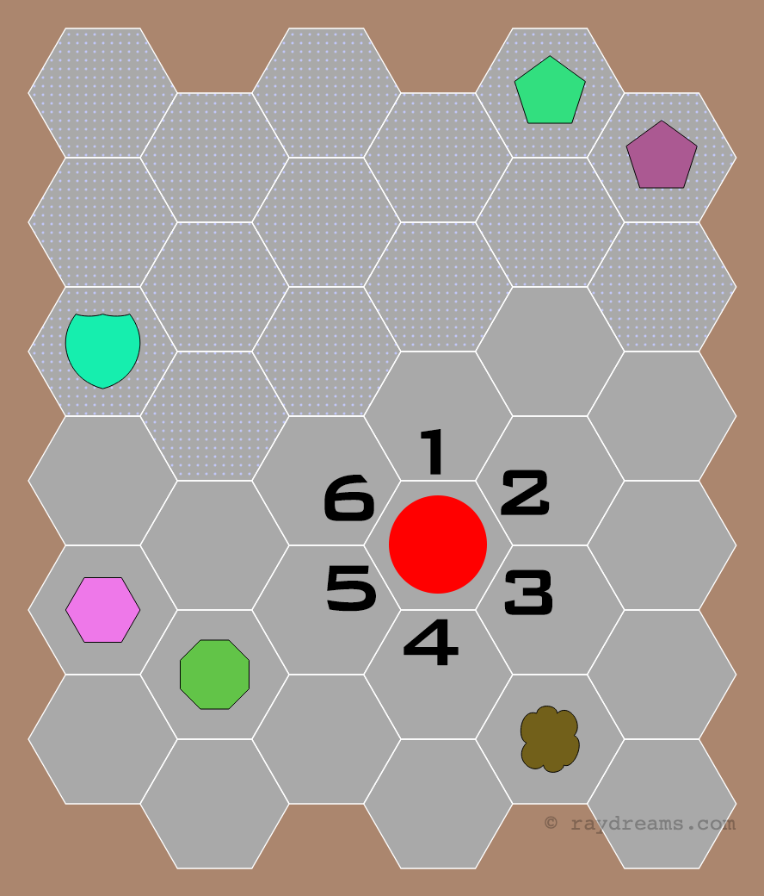

# Conflict Simulator Board Generation API

This documents the JSON document or input format for the Board Builder/ConSim API

## Background & Motivation

**BoardBuilder** (BB) generates old school table top war game boards that primary is played on hexagon maps. However, BB can use the same defintion input to make a square map as well. This repo documents the JSON document format to make something like this:


Several properties are customizable and the image is generated real time via the ConSim API.

### Alpha Testing
For now access to the API is limited to alpha testers and an API key is required to use the API. If you want to help test it you can send me a request via [www.raydreams.com](https://www.raydreams.com/contact)

## Usage
The input is a JSON document which can be sent directly to the API or pulled from some other storage source or read from a local file.

The output is the board image for now which is simple a PNG however JPEG with a quality level will be added as well as BASE64 wrapped in JSON.

### The ConSim API

The API base URL is:

`https://rayrpg.com/api`

For now the only public methods are listed below. In order to use the complete custom method you will need a personal API token to meter your usage of the API in a 24 hour period. This is to prevent people from writing an unauthorized client against the API. 

* **RandomBoard** - Simply generates a random board between 6x6 and 10x10 in size and places some random icons. Purely for demo purposes and testing.
    * Syntax: `/RandomBoard?[type=]`
	* Methods: GET
	* inputs:
		* type (string:hex|sq) specifies either to draw as a hex or square board, the default is hex
	* output: (binary) returns the board as an image file
* **RandomMonster** - Just a fun API that will generate random monster stats for The Fantasy Trip mechanics. The random party will be from `min` to `max` monsters where 1 is the default.
    * Syntax: `/RandomMonster?[min=]&[max=]`
	* Methods: GET|POST
	* inputs:
		* min (int:[1,max]) the minimum number of monsters in the random encounter
        * max (int:[min,20]) the maximum number of monsters in the random encounter
	* output: (JSON array) returns an array of monster statistics to use in TFT
* **Signature** - Simple API Ping to test the service is alive.
	* Methods: GET
	* inputs: (none)
	* output: (string) service signature string and echo info

## The Parent Wrapper
The top level parent wrapper just defines a few fields for how to return the board

- **filename** [string] - specify a filename to be used if the image is downloaded locally, otherwise a random one is created
- **q** [int] - quality of the image in the range 1-100, which only has meaning on JPEGs
- **type** [enum] - the type of image file to return using the enums below. For now only RAW PNGs are returned.
- **board** [object] - the board definition itself

## The Board Object
- **size** [int] hex height in pixel from base to top
- **rows** [int] total number of rows
- **cols** [int] total number of columns
- **mw** [float] margin width
- **bkg** [RGBA hex string] background color
- **sw** [float] stroke width - the width of the hex outline
- **sc** [RGBA hex string] stroke color - the color outlining each hex
- **fill** [RGBA hex string] default hex fill color
- **ls** [float] label font size which will be scaled if too big to fit the hex baseline
- **lc** [RGBA hex string] label color
- **lseq** [enum] label sequence type
- **lff** [string] label font family - not yet implemented
- **origin** [bool] whether to draw the orgin dot on each hexes with no icon or not
- **hexes** [object array] list of hexes to override thre base values (NOTE: this property name will change)
- **terrains** [object array] define spaces to fill with a terrain texture
- **paths** [object array] an array of path elements

## A Space Location Object
For now just defines a board space in 2D row column
- **row** [int] The row of the space
- **col** [int] the column of the space

## A Board Space Override Options
Board spaces will be drawn using the parent values unless an override is specified by Row,Column

- **space** [object] a space location object
- **color** [RGBA hex string] the fill color of this specific space
- **lc** [RGBA hex string] the override color of the label
- **label** [string] a label override value
- **icon** [object] custom icon in this space
- **edges** [object] Edge Options overrides the base border style. Later this will be used to specify edge icons.

## A Space Icon
The options for icons centered in the middel of the space. For now stroke weight is fixed at 1.

- **type** [enum] the icon type enum (see below)
- **fill** [RGBA hex value] the fill color of icon
- **stroke** [RGBA hex value] the stroke color of the icon
- **angle** [float] how much to rotate an icon in degrees, only applied where it makes sense

## Terrain Options
The options to set on each terrain pattern. The same space can have multiple textures though there is no layer order parameter yet.

- **type** [enum] the terrain type enum (see below)
- **color** [RGBA hex value] the line color the pattern is drawn in
- **angle** [float] (not implemented) angle in degrees to rotate the pattern
- **spaces** [object array] - array of space object to specify which spaces to texture
- **options** [float array] - the input options unique to each patter to specify how to draw it, though each pattern has default values

## Edge Options
Override a specific edge of any space. Numbering starts from the top and goes clockwise.
- **side** [int] which side this applies to
- **color** [RGBA hex value] the edge color
- **weight** [float] the stroke weight of the edge

## Paths
The array of paths lets you sepcify long continuous paths
- **color** [RGBA hex value] the edge color
- **weight** [float] the stroke weight of the edge
- **path** [object array] an array of Space Location objects using the additional `side` property to specify the side



## RGBA Hex String
Color values are specified as RGBA Hex e.g. `A3126700`. The hash symbol is not required and the last two hex digits indicate the opacity with FF being fully opaque and 00 fully transparent. Obviously a fully transparent color will result in nothing being seen. You may still use regular RGB hex strings, the Alpha bits are optional so `A31267` is also valid.

The parser will always make an attempt to interpret your color value and fallback to default values.

You may also use the [Web Safe Color](https://en.wikipedia.org/wiki/Web_colors) names.

Three digit values will not cause an error but will not give you the color you expect. They are not yet support. Expand them to 6 digit for now.

## Space Numbering Enums
There are several ways to number each hex. Use the following enumerations in the `lseq` parameter.

- **None** - don't number the spaces
- **RowSequence** - increment across by row major
- **ColSequence** - increment down by column major
- **RowColZeroPad** - e.g. 0207 with row being first
- **ColRowZeroPad** - e.g. 0207 with column being first
- **Index** - the actual index in the data structure which starts at 0
- **ID** - the actual ID used for that space which for now is the same as RowSequence but could later change
- **Left** - (not implemented) Metagaming used a unqiue numbering starting along the left margin and incrementing back up

## Icon Enums
The currently supported list of icon enums (case insensitive). All icons can be rotated by some angle of degrees. A few pre-rotated icons are provided for convenience.

More icon shapes are added all the time.

- **None** - remove the icon display without removing the other values
- **Circle**
- **Triangle**
- **TriangleDown** - a rotated triangle
- **Square**
- **Diamond** - a rotated square
- **Star**
- **Plus**
- **X** - a rotated plus
- **Hex**
- **Pentagon**
- **Octagon**
- **Cloud** - or tree top
- **Dungeon**
- **Castle**
- **Arrow**
- **Ring**
- **Tower**
- **Bar** - thin rectangle
- **Splat** - a splat star pattern
- **Sword**

## Terrain Pattern Enums
The currently supported list of enums (case insensitive) for terrain patterns. Each type has its own unique set of optional paramters input that alter the appearance which is an array of float values

- **None** - remove the pattern display without removing the other values
- **Weave** - [width, gap]
    - pixel width of each line
    - pixel spacing between each line
- **Dots** - [size, spacing]
    - radius of the dots
    - pixel spacing between each dot
- **RandomDots** - [density]
    - density of the dots as a value of 1-100 meaning 0.1% to 10% of the actual pixels
- **ZigZag** - (not implemented)
- **Waves** - [amplitude, frequency] Sine wave pattern
    - height of the waves
    - pixels before repeating a Sine wave
- **Bricks** - [height, width, thickness, offset]
    - pixel height of each line
    - pixel width of each rectangle
    - thickness of the morter lines
    - percent offset 1-100 of each even vs odd rows
- **Diamonds** - (not implemented)
- **Stones** - (not implemented)

## File Type Response Enums
The response type will be settable in the future but for now is set to a PNG.

- **RawPNG** - returns a PNG of the board with the filename set in the disposition header
- **RawJPEG** - (not implemented) returns a JPEG at the input quality with the filename set in the disposition header
- **WrappedPNG** - (not implemented) - BASE64 encodes the PNG and then wraps it in JSON with additional metadata
- **WrappedJPEG** - (not implemented)- BASE64 encodes the JPEG and then wraps it in JSON with additional metadata
- **SVG** - (not implemented) - returns a SVG file of the board

## Example JSON
The following is a simple example of input or stored document input instance.
```
{
    "filename": "mygameboard",
    "q": 75,
    "type": "rawpng",
    "board": {
        "size": 120,
        "rows": 14,
        "cols": 16,
        "lseq": "RowColZeroPad",
        "fill": "7cea43",
        "sc": "e1e1e1",
        "sw": 2.0,
        "bkg": "5400ff",
        "lc": "000000",
        "ls": 15.0,
        "lff": "Courier",
        "mw": 30.0,
        "origin": true,
        "terrains": [
            {
                "type": "weave",
                "color":"ff000099",
                "options":[2,10],
                "spaces": [
                    {
                        "row": 3,
                        "col": 3
                    }
                ]
            }
        ],
        "hexes": [
            {
                "space": {
                    "row": 2,
                    "col": 3
                },
                "color": "06c5fd",
                "label": null,
                "lc": "000000",
                "icon": {
                    "type": "pentagon",
                    "fill": "000099",
                    "stroke": "000000"
                }
            }
        ]
    }
}
```
